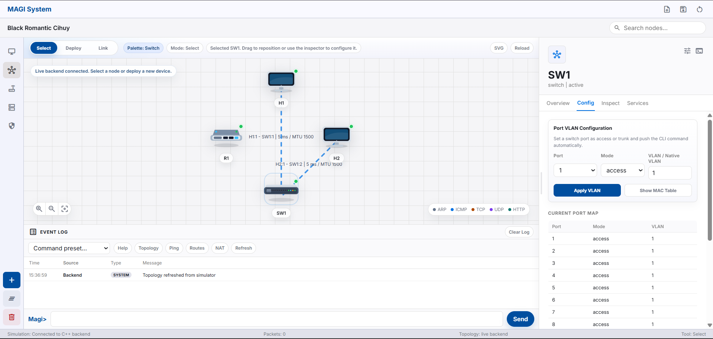

# MAGI System: OSI Layer Network Simulator

<p align="center">
  
</p>

## Overview

MAGI System is an educational network simulator that implements OSI layers L2 through L7 in a modular architecture. Designed for topology experimentation, protocol testing (ARP, IPv4, TCP/UDP), and lightweight application services (DHCP, DNS, HTTP) via an interactive command-line interface.

## Prerequisites

- C++ compiler (g++ or clang) with C++11 support
- `make`
- Terminal/shell for your OS:
  - macOS/Linux: default system terminal
  - Windows: MinGW-w64/MSYS2 with `g++` and `mingw32-make` available in `PATH`

Note: the project has no external dependencies — only a standard compiler and Makefile are required.

## Features

### 1. Topology Management

- Create nodes (host, switch, router), configure ports, cable ports together, and save/load topologies to/from JSON files.
- Commands: `create`, `link`, `unlink`, `save`, `load`, `topology`, `show`.
- Notes: `create` accepts types `host|switch|router`; switches can be created with a specific port count (`create SW1 switch 4`). `link` accepts endpoints as `Node` or `Node:Port` and supports an optional delay argument (ms) for latency simulation.

### 2. Data Link Layer (L2)

- Ethernet frame processing, MAC learning, forwarding, flooding, and VLAN support (access/trunk).
- Commands: `vlan access`, `vlan trunk`, `mac` (display MAC table per switch).
- ARP: hosts send ARP request/reply for MAC address resolution; ARP cache is maintained per host with a simple TTL.

### 3. Network Layer (L3)

- IPv4 routing (longest-prefix match), TTL management, checksum calculation, and ICMP message generation (e.g. destination unreachable, time exceeded).
- Routers have a routing table modifiable via `route` and `route add`.

### 4. Transport Layer (L4)

- **TCP:**
  - Full state machine for 3-way handshake, data transfer (PSH), and 4-way teardown (FIN/ACK).
  - Simple receive buffer, partial retransmission (didactic), and `tcp_connect` API for connection testing.
- **UDP:**
  - Connectionless datagram transport used by internal services like DHCP and DNS.
  - CLI: `udp_send` for manually sending UDP payloads from a host.

### 5. Application Layer (L7)

- **MagiSocket:** L7 socket abstraction over the simulator's TCP/UDP implementation; provides connect/accept/send/recv API for applications.
- **DHCP:** Simple server/client demonstrating the DORA sequence (Discover/Offer/Request/Ack) and dynamic address allocation to hosts.
- **DNS:** Minimal UDP-based resolver and server mapping hostnames in the topology to IP addresses; used by `http_get` for name resolution. Not a full RFC implementation, but sufficient for lab scenarios and integration tests.
- **HTTP:** Static file server (e.g. `index.html`) hosted on a node; client performs GET using the internal DNS resolver. Interaction goes through `MagiSocket` and demonstrates the full TCP 3-way handshake, request/response, and teardown flow.

### 6. Interactive CLI and Automation

- The CLI provides an interactive mode for manual scenario execution, and commands can be scripted for automation (load/save topology + run commands).

### 7. Test Suite

- The `test/` folder contains per-milestone tests, including L7 integration tests (e.g. DNS to HTTP) that can be run to verify end-to-end flows.

### 8. Extensibility

- The `middleboxes/` and `utils/` directories are available for additional experiments such as a simple firewall, NAT, or other middlebox components.

## Build and Run

All commands can be run from the repository root.

```bash
make            # build CLI
make run        # launch interactive CLI
make test       # run unit/integration tests
```

To launch the web dashboard:

```bash
make run-web
```

Dashboard will be available at:

```
http://127.0.0.1:8080/gui/index.html
```

Use a different port if 8080 is occupied:

```bash
make run-web PORT=9090
```

On Windows, use `mingw32-make` if `make` is unavailable:

```bat
mingw32-make run
mingw32-make run-web
mingw32-make run-web PORT=9090
```

The Makefile will automatically produce a `.exe` executable on Windows and link the required Winsock libraries for the web server.

Alternatively, from inside the `magi_system` directory:

```bash
cd magi_system
make
make run
make run-web
```

Notes:
- Press `Ctrl+C` to stop the web server.
- If the Makefile provides a `makerun` target, use `make makerun` as a CLI shortcut.
- For a clean rebuild: `make clean && make`.

## Project Structure

```
magi_system/
├─ Makefile
├─ main.cpp
├─ cli.cpp
├─ cli.hpp
├─ topology.json
├─ magi_system            # executable / runtime binary (build target)
├─ build/                 # generated object files and dependencies
├─ core/
│  ├─ interface.cpp/.hpp
│  ├─ link.cpp/.hpp
│  ├─ node.cpp/.hpp
│  └─ packet.cpp/.hpp
├─ gui/
├─ layer2/
│  ├─ arp.cpp/.hpp
│  ├─ ethernet.cpp/.hpp
│  ├─ host.cpp/.hpp
│  └─ switch.cpp/.hpp
├─ layer3/
│  ├─ icmp.cpp/.hpp
│  ├─ ipv4.cpp/.hpp
│  └─ ip_utils.hpp
├─ layer4/
│  ├─ tcp.cpp/.hpp
│  ├─ tcp_socket.cpp/.hpp
│  └─ udp.cpp/.hpp
├─ layer7/
│  ├─ dhcp_*.cpp/.hpp
│  ├─ dns_*.cpp/.hpp
│  ├─ http_*.cpp/.hpp
│  └─ magi_socket.cpp/.hpp
├─ middleboxes/
├─ test/
│  ├─ test_common.hpp
│  ├─ test_main.cpp
│  └─ milestone-1/..-4/   # per-milestone test suites
├─ utils/
```

## Supported Commands

### Topology

- `create <name> <host|switch|router> [ports]` — create a node
- `link <endpointA> <endpointB> [delay_ms]` — connect endpoints (`H1`, `SW1:2`)
- `unlink <endpointA> <endpointB>` — remove a link
- `topology` — display topology summary
- `show <node>` — display node details

### Address and Routing Configuration

- `setip <host> <ip/cidr>` — assign an address to a host
- `setgw <host> <gateway_ip>` — set the default gateway
- `route <router>` — display a router's routing table
- `route add <router> <dest_cidr> <next_hop_ip> <out_interface>` — add a route

### VLAN and Switch

- `vlan access <switch> <port> <vlan_id>`
- `vlan trunk <switch> <port> <native_vlan>`
- `mac <switch>` — display MAC table

### ARP / L2 Utilities

- `arp <host>` — display a host's ARP cache

### Testing and Monitoring

- `ping <host> <target_ip>`
- `traceroute <host> <target_ip>`
- `tcp_connect <host> <ip> <port>` — attempt a TCP connection
- `udp_send <host> <ip> <src_port> <dst_port> [payload]` — send a UDP packet

### L7 Services (Control)

- `http_get <host> <hostname>` — HTTP client using the internal resolver
- `http_server start <host> <file>` / `http_server stop <host>`
- `dns_server start <host>` / `dns_server stop <host>`
- `dhcp_server start <host>` / `dhcp_server stop <host>`
- `dhcp_discover <host>` — run DHCP client discovery from a host

### File I/O

- `save [file]` — save topology (default: `topology.json`)
- `load [file]` — load topology from file

### General

- `help` — list available commands
- `exit` / `quit` — exit the simulator

## Endpoint Format

- `NodeName` — for hosts, automatically uses port 1
- `NodeName:Port` — for switches/routers, e.g. `SW1:1` or `R1:2`

## Usage Example

```
Magi> create H1 host
Host 'H1' created successfully.

Magi> create H2 host
Host 'H2' created successfully.

Magi> create SW1 switch 4
Switch 'SW1' with 4 ports created successfully.

Magi> link H1 SW1:1
Successfully linked H1 to SW1:1.

Magi> link H2 SW1:2
Successfully linked H2 to SW1:2.

Magi> topology

=== TOPOLOGY ===

Nodes:
  H1 (host)
  H2 (host)
  SW1 (switch)

Links:
  H1:1 <-> SW1:1
  H2:1 <-> SW1:2

Magi> save my_topology.json
Topology saved to 'my_topology.json'.

Magi> exit
Shutting down Magi System Simulator...
```

## JSON File Format

```json
{
  "hosts": [
    {
      "name": "H1",
      "ip_address": "192.168.1.10/24",
      "default_gateway": "192.168.1.1"
    }
  ],
  "switches": [
    {
      "name": "SW1",
      "num_ports": 24,
      "vlans": []
    }
  ],
  "routers": [
    {
      "name": "R1",
      "interfaces": [],
      "routing_table": []
    }
  ],
  "links": [
    {
      "endpoints": ["H1", "SW1:1"],
      "delay": 0
    }
  ]
}
```

## Milestones

- [x] **Milestone 0: Simulation Foundation** — Physical class construction (Interface, Link), base Packet structure supporting raw byte conversion, and JSON topology loading.
- [x] **Milestone 1: Data Link Layer (L2)** — Ethernet Frame implementation, VLAN-aware switching logic, and IP packet queuing via ARP Cache.
- [x] **Milestone 2: Network Layer (L3)** — Longest Prefix Match routing resolution, inter-VLAN routing, TTL modification, IPv4 checksum calculation, and ICMP error message delivery.
- [x] **Milestone 3: Transport Layer (L4)** — TCP state machine (3-way handshake, receive buffers, 4-way teardown), UDP protocol, and pseudo-header checksum calculation.
- [x] **Milestone 4: Application Layer (L7)** — MagiSocket wrapper API abstracting OS communication, plus standalone DHCP, DNS, and HTTP server services.
- [x] **Milestone 5: Bonus Features** — IP fragmentation and reassembly, topology visualizer, ACL firewall, NAT/PAT, dynamic routing, and GUI.

## Task Distribution

| Name                          | Student ID | Milestones     |
|-------------------------------|------------|----------------|
| Muhammad Aufar Rizqi Kusuma   | 13524061   | Milestone 4, 5 |
| Kurt Mikhael Purba            | 13524065   | Milestone 0, 5 |
| Bryan Pratama Putra Hendra    | 13524067   | Milestone 2, 5 |
| Philipp Hamara                | 13524101   | Milestone 1, 3, 5 |